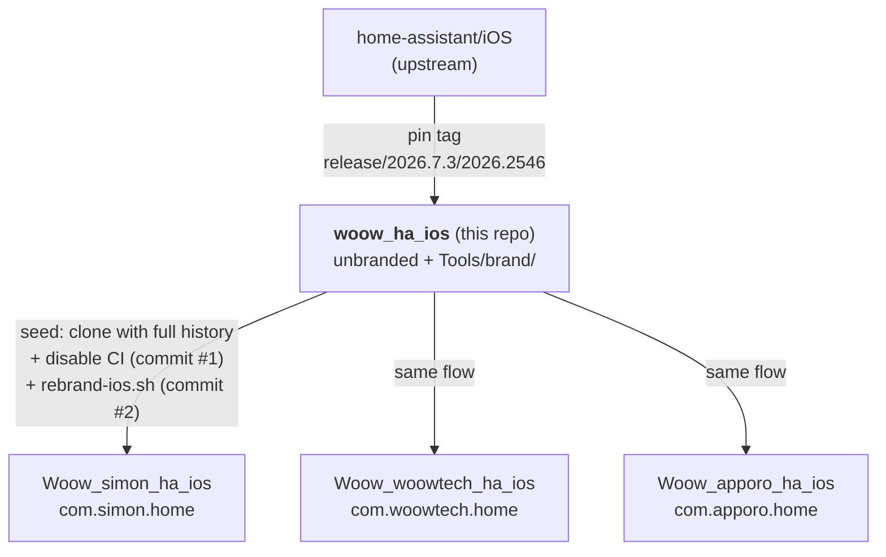
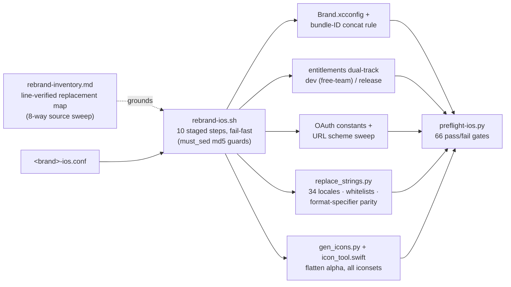

<h1 align="center">woow_ha_ios</h1>

<p align="center">
  <strong>Woow base fork of <a href="https://github.com/home-assistant/iOS">home-assistant/iOS</a> + white-label rebrand toolkit</strong><br/>
  Pinned upstream, scripted branding, preflight-gated — seed once per brand, rebrand in one run
</p>

<p align="center">
  <a href="#what-this-repo-is">About</a> &bull;
  <a href="#topology">Topology</a> &bull;
  <a href="#the-rebrand-toolkit">Toolkit</a> &bull;
  <a href="#usage-new-brand">Usage</a> &bull;
  <a href="#local-build-environment">Environment</a> &bull;
  <a href="#upstream-policy">Upstream policy</a> &bull;
  <a href="README_zh-TW.md">中文文件</a>
</p>

<p align="center">
  
  
  
  
</p>

---

## What this repo is

This is the **shared base** for Woow's white-label iOS builds of the Home Assistant
Companion app. It is upstream code pinned at tag `release/2026.7.3/2026.2546`
(commit `70e675a8`, the 2026-08-04 App Store release), **unbranded**, plus:

- `Tools/brand/` — the complete rebrand toolkit (script, string engine, icon
  pipeline, 66-gate preflight, line-verified replacement inventory)
- `docs/` — fork-divergence ledger, environment trap notes, per-brand reuse guides

Brand repos are seeded **from here** with full git history, then branded by one
scripted run. Production brands:
[`Woow_simon_ha_ios`](https://github.com/WOOWTECH/Woow_simon_ha_ios) (`com.simon.home`,
simulator-verified against a live HA 2026.4.2 server),
[`Woow_woowtech_ha_ios`](https://github.com/WOOWTECH/Woow_woowtech_ha_ios)
(`com.woowtech.home`), and
[`Woow_apporo_ha_ios`](https://github.com/WOOWTECH/Woow_apporo_ha_ios) (`com.apporo.home`).

## Topology



Rules (mirroring the Android `Woow_simon_ha_app` conventions):

- No merges/cherry-picks between base and brand repos — shared changes flow **down**
  from the base (re-seed or manual pick)
- Never seed a new brand from an already-branded tree (the script's keywords are gone)
- Never rename Swift modules, targets, or `HomeAssistant.xcodeproj` itself (keeps
  future upstream picks reviewable)
- The rebrand script is **one-shot**: to change parameters,
  `git reset --hard pre-rebrand` and run again

## The Rebrand Toolkit



| File | Role |
|---|---|
| `Tools/brand/rebrand-ios.sh` | Orchestrator — every substitution guarded by an md5 "must-change" check; dies loudly on pattern drift |
| `Tools/brand/simon-ios.conf` | Brand parameter file (copy per brand) |
| `Tools/brand/replace_strings.py` | Localization engine: full-text entry parser (multi-line values), key/value whitelists (Nabu Casa, mDNS placeholders), `%@` format-specifier parity check, `plutil -lint` gate |
| `Tools/brand/gen_icons.py` + `icon_tool.swift` | CoreGraphics icon pipeline — flattens alpha onto brand color, regenerates every `.appiconset`/logo imageset incl. alternate-icon previews; no ImageMagick needed |
| `Tools/brand/preflight-ios.py` | 66 checks: OAuth constants, scheme residue, bundle-ID concat in xcconfig/entitlements/plists, dual-track wiring, icon alpha, brand colors, entry-link residue, Lokalise-workflow safety net |
| `Tools/brand/rebrand-inventory.md` | Ground truth: what to replace/keep/decide, file:line, produced by 8 parallel scouts against the pinned tree |
| `Tools/brand/android-reference/` | The Android toolkit (`Woow_simon_ha_app`) kept for pattern parity |

The toolkit survived a **5-lens adversarial review** (sed/shell semantics, cross-file
consistency, string-engine dry runs on real locale files, icon-pipeline enumeration,
coverage-vs-inventory audit) which caught 15 defects — including two would-be
disasters (newline corruption across all 34 locales; a first-iconset crash that would
have left a half-branded tree) — **before** the first real run.

## Usage (new brand)

```bash
# 1. seed
git clone <this repo> Woow_<brand>_ha_ios && cd Woow_<brand>_ha_ios
git remote rename origin base
git rm -rq .github/workflows && git commit -m "ci: disable upstream workflows"
git tag pre-rebrand

# 2. configure + run
cp Tools/brand/simon-ios.conf Tools/brand/<brand>-ios.conf   # edit parameters
bash Tools/brand/rebrand-ios.sh Tools/brand/<brand>-ios.conf
python3 Tools/brand/preflight-ios.py Tools/brand/<brand>-ios.conf   # must be all green

# 3. build
pod install
DEVELOPER_DIR=/Applications/Xcode.app/Contents/Developer \
xcodebuild -workspace HomeAssistant.xcworkspace -scheme App-Debug \
  -destination 'platform=iOS Simulator,name=iPhone 17' build
```

**Before running**: the brand's OAuth `client_id` page must already be live and
declare `<scheme>://auth-callback` (IndieAuth) — otherwise sign-in breaks against
every standard HA server. Full checklist: [`docs/apporo-reuse.md`](docs/apporo-reuse.md).

## Local Build Environment

Hard-won environment notes for this pinned tag (details in
[`docs/fork-divergence.md`](docs/fork-divergence.md)):

| Trap | Resolution |
|---|---|
| Tag still uses **CocoaPods** (upstream dropped it later) | `brew install cocoapods` + install `cocoapods-acknowledgements` into its gem home; skip bundler entirely |
| ruby 3.1.2 (`.ruby-version`) won't compile under Xcode 26 clang | Not needed for building — Fastlane only |
| App scheme embeds a Watch app | Download the **watchOS platform** once, or scheme validation blocks every build |
| SwiftLint build phase hard-fails when tools missing | `brew install swiftlint swiftformat` |
| `xcode-select` points at CLT on this machine | Prefix all commands with `DEVELOPER_DIR=/Applications/Xcode.app/Contents/Developer` |
| Xcode 26.6 simulators | Use `iPhone 17` (there is no iPhone 16 runtime) |

## Upstream Policy

- **Pin, don't track**: no rolling merges. Review `home-assistant/iOS` releases
  monthly and before each brand release; cherry-pick security fixes manually and
  record them in the divergence ledger
- **Never push upstream** from this fork family (OHF policy on autonomous-agent
  contributions; also nothing here is upstream-relevant)
- Apache 2.0 [`LICENSE.md`](LICENSE.md) and the in-app open-source acknowledgements
  page are preserved in every brand build

## License

Modified distribution of Home Assistant Companion for iOS, © Home Assistant
contributors — [Apache License 2.0](LICENSE.md).
