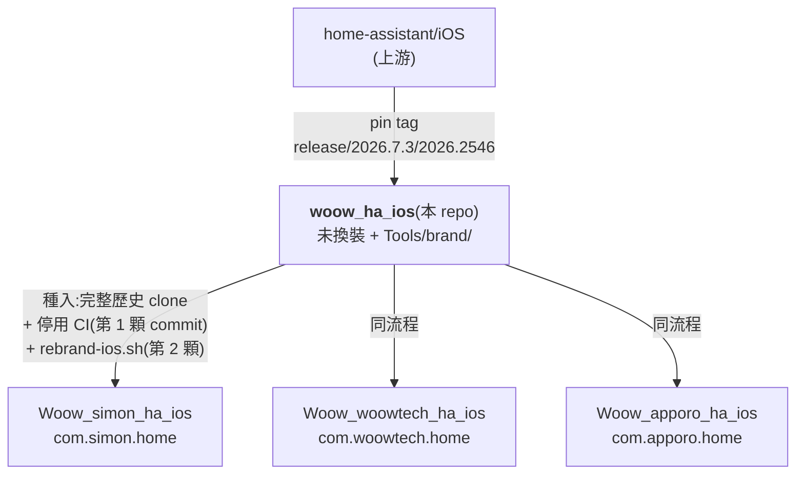
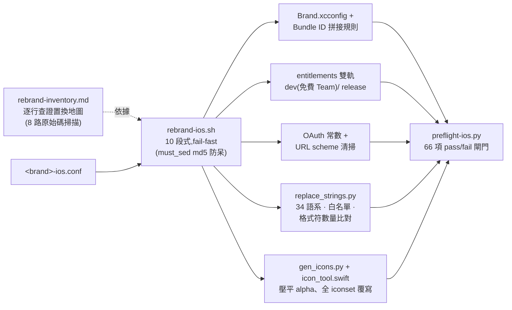

<h1 align="center">woow_ha_ios</h1>

<p align="center">
  <strong><a href="https://github.com/home-assistant/iOS">home-assistant/iOS</a> 的 Woow 基底 fork + 白牌換裝工具組</strong><br/>
  上游 pin 死、腳本化換裝、preflight 把關——每品牌種入一次,一鍵換裝
</p>

<p align="center">
  <a href="#這個-repo-是什麼">簡介</a> &bull;
  <a href="#拓撲">拓撲</a> &bull;
  <a href="#換裝工具組">工具組</a> &bull;
  <a href="#新品牌使用方式">使用方式</a> &bull;
  <a href="#本機編譯環境">環境</a> &bull;
  <a href="#上游策略">上游策略</a> &bull;
  <a href="README.md">English</a>
</p>

<p align="center">
  
  
  
  
</p>

---

## 這個 repo 是什麼

Woow 全系列白牌 iOS Home Assistant Companion 的**共用基底**:上游程式碼 pin 在
tag `release/2026.7.3/2026.2546`(commit `70e675a8`,2026-08-04 上架的 App Store 版),
**未換裝**,外加:

- `Tools/brand/`——完整換裝工具組(主腳本、字串引擎、icon 管線、66 項 preflight、
  逐行查證的置換清單)
- `docs/`——fork-divergence 帳本、環境踩雷筆記、品牌重用指南

品牌 repo **從這裡**種入完整 git 歷史,再一鍵換裝。量產品牌:
[`Woow_simon_ha_ios`](https://github.com/WOOWTECH/Woow_simon_ha_ios)(`com.simon.home`,
已對真實 HA 2026.4.2 伺服器完成模擬器驗證)、
[`Woow_woowtech_ha_ios`](https://github.com/WOOWTECH/Woow_woowtech_ha_ios)
(`com.woowtech.home`)、
[`Woow_apporo_ha_ios`](https://github.com/WOOWTECH/Woow_apporo_ha_ios)(`com.apporo.home`)。

## 拓撲



規則(沿用 Android `Woow_simon_ha_app` 慣例):

- 基底與品牌 repo 之間**不 merge、不 cherry-pick**——共通變更由基底往下流(重種或手動 pick)
- **絕不從已換裝的樹種新品牌**(腳本關鍵字已被換掉)
- 不改 Swift module 名、target 名、`HomeAssistant.xcodeproj` 檔名(保住未來上游 pick 的可讀性)
- 換裝腳本**一次性**:要改參數 → `git reset --hard pre-rebrand` 重跑

## 換裝工具組



| 檔案 | 角色 |
|---|---|
| `Tools/brand/rebrand-ios.sh` | 主腳本——每條替換都有 md5「必須有變化」防呆,pattern 飄掉立刻報死 |
| `Tools/brand/simon-ios.conf` | 品牌參數檔(每品牌複製一份) |
| `Tools/brand/replace_strings.py` | 本地化引擎:全文條目解析(支援多行 value)、key/value 白名單(Nabu Casa、mDNS placeholder)、`%@` 格式符數量比對、`plutil -lint` 閘門 |
| `Tools/brand/gen_icons.py` + `icon_tool.swift` | CoreGraphics icon 管線——alpha 壓平到品牌色、覆寫所有 `.appiconset`/logo imageset(含替代 icon 預覽);不需 ImageMagick |
| `Tools/brand/preflight-ios.py` | 66 項檢查:OAuth 常數、scheme 殘留、xcconfig/entitlements/plist 三方拼接、雙軌佈線、icon alpha、品牌色、入口連結殘留、Lokalise workflow 安全網 |
| `Tools/brand/rebrand-inventory.md` | Ground truth:該換/該留/待決,精確到 file:line,由 8 路並行掃描產出 |
| `Tools/brand/android-reference/` | Android 版工具組(`Woow_simon_ha_app`)留作模式對照 |

工具組在首次真正執行前通過 **5 視角對抗性審查**(sed/shell 語意、跨檔一致性、
字串引擎對真實語系檔乾跑、icon 管線窮舉、覆蓋率對帳),抓出 15 個缺陷——
包括兩個災難級(34 語系全滅的換行毀損、第一個 iconset 就崩潰留下半換裝樹)。

## 新品牌使用方式

```bash
# 1. 種入
git clone <本 repo> Woow_<brand>_ha_ios && cd Woow_<brand>_ha_ios
git remote rename origin base
git rm -rq .github/workflows && git commit -m "ci: disable upstream workflows"
git tag pre-rebrand

# 2. 設定 + 執行
cp Tools/brand/simon-ios.conf Tools/brand/<brand>-ios.conf   # 改參數
bash Tools/brand/rebrand-ios.sh Tools/brand/<brand>-ios.conf
python3 Tools/brand/preflight-ios.py Tools/brand/<brand>-ios.conf   # 必須全綠

# 3. 編譯
pod install
DEVELOPER_DIR=/Applications/Xcode.app/Contents/Developer \
xcodebuild -workspace HomeAssistant.xcworkspace -scheme App-Debug \
  -destination 'platform=iOS Simulator,name=iPhone 17' build
```

**執行前**:品牌的 OAuth `client_id` 頁必須已上線並宣告
`<scheme>://auth-callback`(IndieAuth),否則對所有標準 HA 伺服器登入全斷。
完整清單:[`docs/apporo-reuse.md`](docs/apporo-reuse.md)。

## 本機編譯環境

pin tag 的踩雷實錄(細節見 [`docs/fork-divergence.md`](docs/fork-divergence.md)):

| 雷 | 解法 |
|---|---|
| 此 tag 還在用 **CocoaPods**(上游後來才移除) | `brew install cocoapods` + 把 `cocoapods-acknowledgements` 裝進其 gem home;完全跳過 bundler |
| ruby 3.1.2(`.ruby-version`)在 Xcode 26 clang 下編不起來 | 編譯用不到——那是 Fastlane 的事 |
| App scheme 內嵌 Watch app | 下載一次 **watchOS platform**,否則 scheme 驗證擋掉所有編譯 |
| SwiftLint build phase 缺工具直接紅 | `brew install swiftlint swiftformat` |
| 本機 `xcode-select` 指向 CLT | 所有指令前綴 `DEVELOPER_DIR=/Applications/Xcode.app/Contents/Developer` |
| Xcode 26.6 模擬器機型 | 用 `iPhone 17`(沒有 iPhone 16 runtime) |

## 上游策略

- **Pin 死、不追蹤**:不滾動 merge。每月＋每次品牌 release 前檢視上游 releases,
  安全修正手動 cherry-pick 並記入 divergence 帳本
- 本 fork 家族**不回推上游**(遵守 OHF 對 autonomous-agent 貢獻的政策)
- 每個品牌 build 都保留 Apache 2.0 [`LICENSE.md`](LICENSE.md) 與 app 內開源致謝頁

## 授權

Home Assistant Companion for iOS 之修改發行版,© Home Assistant contributors——
[Apache License 2.0](LICENSE.md)。
